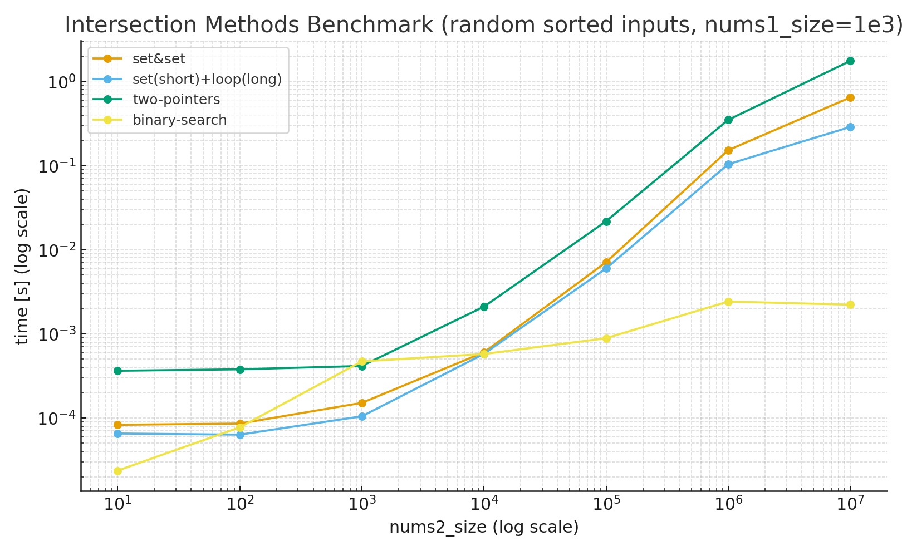

## 今回の問題
[349. Intersection of Two Arrays](https://leetcode.com/problems/intersection-of-two-arrays)

### 概要
Given two integer arrays nums1 and nums2, return an array of their intersection. Each element in the result must be unique and you may return the result in any order.

## 次に取り組む予定の問題
[929. Unique Email Addresses](https://leetcode.com/problems/unique-email-addresses)

## Step.1: 何も見ず考える（まずは正解を通すことを目標に）
#### 何を考えて解いていたか
- 各リストをsetにして、積集合を取る
- 時間計算量O(n1+n2)
- 空間計算量O(n1+n2)

## Step.2: 他の人の回答、レビュー内容を参考にする
### 他の人のコードを読んで考えたこと
- 入力の条件により、ベストな解法が異なりそう
- 両方setする必要はない
- 条件
    - 1.未ソート／片方が極端に長い
        - 短い方をsetにして、長い方をloopで回してlookup
        - 時間: O(n1 + n2)
        - 空間: O(min(n1, n2))
        - ※時間計算量はbig-O記法上はstep1のset解法と同じだが定数項の中身が異なる
            - step1の解法: set構築 x2
            - 本解法     : set構築 x1 + loop(lookup) x1
    - 2.ソート済み／長さはほぼ同じ
        - 2ポインタ法
        - 時間: O(n1 + n2)
        - 空間: O(1)
    - 3.ソート済み／片方が極端に長い
        - 2分探索法
        - 時間: O(n1 log n2)
        - 空間: O(1)
- ベンチ結果
    - 入力はランダム生成した後、ソートしてからベンチにかける
    - nums1の要素数: 1000
    - nums2の要素数: 1e1~1e7
        - 

## Step.3: 10分以内にノーミスで3回連続解く
### 解法
- 入力が未ソートで最も計算コストが低い手法として、 短い方をsetにして、長い方をloopで回してlookupする解法を採用
- 時間: O(n1 + n2)
- 空間: O(min(n1, n2))

## Step.4: レビューをもとにコードを修正する

## その他

## discord送信用
お世話になっております。
349. Intersection of Two Arrays に取り組みました。
お忙しい中恐れ入りますが、お手隙の際にレビューいただけたら幸いです。

問題: https://leetcode.com/problems/intersection-of-two-arrays/
PR: https://github.com/yas-2023/leetcode_arai60/pull/13
言語: Python3

どうぞよろしくお願い致します。
