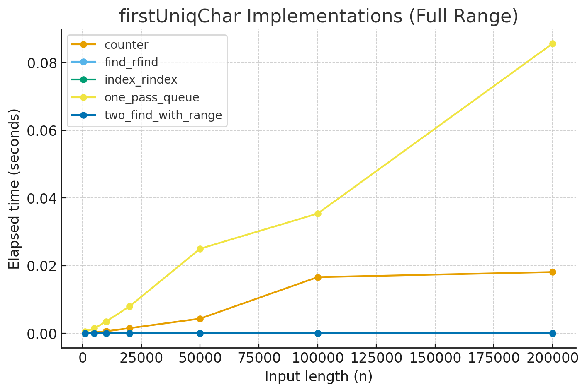

## 今回の問題
[387. First Unique Character in a String](https://leetcode.com/problems/first-unique-character-in-a-string)

### 概要
Given a string s, find the first non-repeating character in it and return its index. If it does not exist, return -1.

## 次に取り組む予定の問題
[560. Subarray Sum Equals K](https://leetcode.com/problems/subarray-sum-equals-k)

## Step.1: 何も見ず考える（まずは正解を通すことを目標に）
#### 何を考えて解いていたか
- 辞書を用いて、値をタプルにする。タプルの0番目は出現回数、1番目は最初のインデックス。
- 最後に、出現回数が1のものの中で、最初のインデックスが最小のものを返す
- 2周しなければならないので、もっと良い方法があるかもしれない。
- 時間計算量: O(n)
- 空間計算量: O(n)

## Step.2: 他の人の回答、レビュー内容を参考にする
### 他の人のコードを読んで考えたこと
- https://github.com/docto-rin/leetcode/pull/15/commits/60dc92c34a7655e7c7bc6dbc96eaea9506ee9b9b
    - 最近のpythonの辞書は順番が保証されるということを使える
    - 例外処理として、全文字種が2回以上でたら早期リターンという実装
    - ネイティブコード find, rfindを使う方法(n^2だがネイティブコードなので高速)
    - 1-pass で処理するにあたり、文字をキューに入れていき、 2 回以上出現する文字を取り除いていくという方法
- https://github.com/Mike0121/LeetCode/pull/32/commits/f59e4297ed85696fd7210b424096115766c3e307
    - str.index, str.rindexを使う手法
    - str.indexを使う手法
    - counterを使う手法

### 解法の種類(step1の解法を除く)
- 1. 1-pass
- 2. str.find, str.rfind (str.findは文字が見つからない場合は-1を返す)
- 3. str.index, str.rindex 
    - (今回のケースでは問題にならないが、文字が見つからない場合ValueErrorとなる点がfindと異なる)
- 4. str.find + enumerate
- 5. counter
- ベンチマーク結果
    - str.index, str.findなどのC実装されている関数を使う手法がO(N^2)にも関わらず速い 

## Step.3: 10分以内にノーミスで3回連続解く
### 計算量の見積もり
- N : s.len()
- 時間計算量: O(N)
- 空間計算量: O(1)

## Step.4: レビューをもとにコードを修正する

## その他

## discord送信用
お世話になっております。
387. First Unique Character in a String に取り組みました。
お忙しい中恐れ入りますが、お手隙の際にレビューいただけたら幸いです。

問題: https://leetcode.com/problems/first-unique-character-in-a-string/
PR: https://github.com/yas-2023/leetcode_arai60/pull/15
言語: Python3

どうぞよろしくお願い致します。
